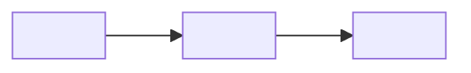

<!--
Variant: mermaid
Selected when: state.userPreferences.diagramFormat == "mermaid"
Purpose: lightweight starting scaffold for Mermaid flowchart diagrams in ADRs
-->

# Diagram (Mermaid)

```mermaid
flowchart LR
    componentA[<componentA>] --> componentB[<componentB>]
    componentB --> componentC[<componentC>]
```
